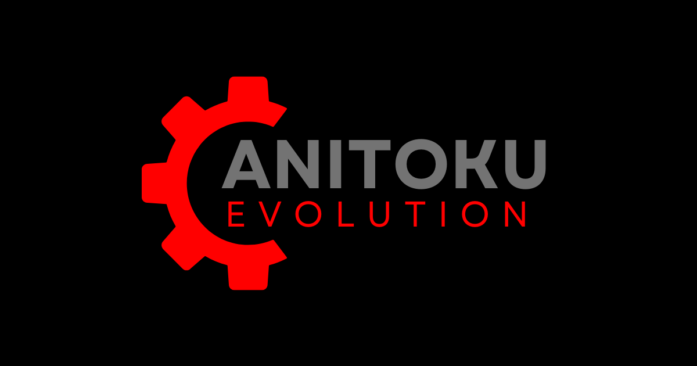

# TOMS

This project was created by TOMS and is built using React technology.

## Setup and Running the Project

1. **Clone the Project**\
   Clone the project from GitHub using the following command:

   ```bash
   git clone <repository-url>
   ```

2. **Install Dependencies**\
   Navigate to the project folder and install the required packages using npm:

   ```bash
   cd <project-folder>
   npm install
   ```

3. **Run the Project**\
   Start the project on a local server with:

   ```bash
   npm start
   ```

## Deploying to Vercel

To deploy the project to Vercel, use the following command:

```bash
vercel
```

**Note**: Ensure Vercel CLI is installed (`npm install -g vercel`). Run the above command in the project folder and follow the prompts to configure the deployment.